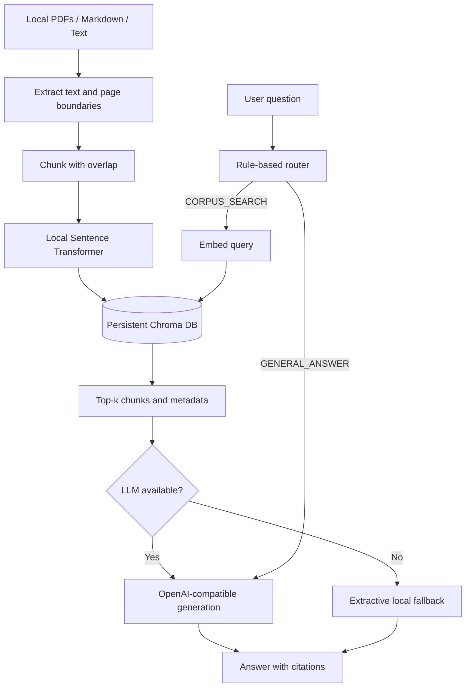

# Research RAG Agent

A local-first research assistant that ingests PDFs and notes, builds a semantic Chroma index, routes questions between corpus search and general answering, and returns source-aware answers.

**Primary demonstration:** local document ingestion, PDF extraction, chunking, embeddings, semantic retrieval, routing, citations, and a document-retrieval check.

## What I Built

Research documents are often difficult to search consistently. This project turns a local folder of PDFs, Markdown, and text notes into a searchable research corpus without uploading the documents to a hosted vector database.

The system demonstrates an end-to-end RAG workflow:

```text
Local files -> PDF/text extraction -> page-aware chunks -> local embeddings
    -> persistent Chroma index -> semantic retrieval -> routed answer
```

The included sample corpus uses two public NIST AI publications. Private or unpublished documents can be placed in the same local folder and remain outside Git.

## Key Features

- Recursive ingestion of `.pdf`, `.md`, and `.txt` files
- Page-aware PDF extraction with source metadata
- Overlapping character-based chunking
- Local Sentence Transformers embeddings
- Persistent Chroma vector database with cosine similarity
- Rule-based `CORPUS_SEARCH` versus `GENERAL_ANSWER` routing
- Top-k retrieval with document and page citations
- Extractive fallback when no LLM endpoint is configured
- Optional OpenAI-compatible generation through Hugging Face, OpenAI, or a local server
- Five-question informal retrieval evaluation
- CLI and optional Streamlit interface
- Local-only corpus policy suitable for private research notes

## Architecture



### Data flow

1. `scripts/download_public_corpus.py` optionally downloads the public sample files.
2. `src/ingest.py` finds supported files recursively and preserves PDF page boundaries.
3. `src/chunker.py` creates overlapping chunks.
4. `src/embeddings.py` generates normalized local embeddings.
5. `src/vector_store.py` persists chunks and metadata in Chroma.
6. `src/router.py` chooses the query route.
7. `src/pipeline.py` retrieves context, calls the configured LLM, or uses the local fallback.
8. `evaluation/evaluate.py` measures whether the expected source document appears in the unique top-k results.

## Technology Stack

| Area | Technology | Purpose |
| --- | --- | --- |
| Language | Python 3.10+ | Application and CLI orchestration |
| PDF extraction | PyPDF | Page-level text extraction |
| Embeddings | Sentence Transformers | Local semantic representations |
| Vector database | Chroma | Persistent local similarity search |
| Generation | OpenAI-compatible HTTP API | Optional answer generation |
| Evaluation | Pytest and custom evaluator | Deterministic tests and retrieval check |
| Interface | argparse and Streamlit | CLI and optional browser UI |

The default embedding model is `sentence-transformers/all-MiniLM-L6-v2`. The first run downloads model weights and works on CPU; a GPU is optional, not required.

## Repository Structure

```text
research-rag-agent/
├── README.md
├── requirements.txt
├── .env.example
├── app.py                         # Optional Streamlit UI
├── diagrams/architecture.mmd      # Mermaid architecture source
├── evaluation/
│   ├── evaluate.py                # Informal top-k source evaluation
│   └── questions.json             # Five corpus-grounded questions
├── scripts/
│   └── download_public_corpus.py  # Recreates the public sample corpus
├── src/
│   ├── chunker.py                 # Overlapping text chunks
│   ├── embeddings.py              # Local embedding model wrapper
│   ├── generator.py               # LLM client and extractive fallback
│   ├── ingest.py                  # File discovery, extraction, indexing
│   ├── main.py                    # CLI entry point
│   ├── pipeline.py                # Routing, retrieval, and answering
│   ├── retriever.py               # Small deterministic ranking utility
│   ├── router.py                  # Query route classifier
│   └── vector_store.py            # Chroma persistence and queries
├── tests/                         # Unit and edge-case tests
├── data/corpus/                   # Local documents; the whole tree is gitignored
└── chroma_db/                     # Generated index; the whole tree is gitignored
```

## Setup

### Requirements

- Python 3.10 or newer
- CPU: sufficient for the sample corpus; GPU is optional
- Approximately 1 GB of free disk space for Python dependencies and first-run model caches
- Internet access only for dependency/model downloads and optional hosted LLM calls

Create an environment and install dependencies:

```powershell
python -m venv .venv
.venv\Scripts\Activate.ps1
python -m pip install -r requirements.txt
Copy-Item .env.example .env
```

On macOS/Linux, use `source .venv/bin/activate` and `cp .env.example .env`.

### Configuration

`.env` is local-only and ignored by Git.

| Variable | Default | Description |
| --- | --- | --- |
| `LLM_API_KEY` | empty | Token for the selected OpenAI-compatible provider |
| `LLM_BASE_URL` | `https://router.huggingface.co/v1` in the template | Chat completions endpoint |
| `LLM_MODEL` | `Qwen/Qwen2.5-7B-Instruct` | Generation model identifier |
| `EMBEDDING_MODEL` | `sentence-transformers/all-MiniLM-L6-v2` | Local embedding model |
| `CHROMA_PATH` | `./chroma_db` | Local vector database path |
| `COLLECTION_NAME` | `research_corpus` | Chroma collection name |

The Hugging Face route requires a free access token with inference permission and is subject to provider credits and rate limits. OpenAI, LM Studio, Ollama, llama.cpp, and other OpenAI-compatible services can be used by changing `LLM_BASE_URL` and `LLM_MODEL`.

No LLM credential is required for corpus retrieval: when generation is unavailable, the project returns an explicitly labelled extractive answer from the retrieved context. General questions require a configured generation endpoint.

## Reproducible Demo

### 1. Download the public sample corpus

```powershell
python scripts/download_public_corpus.py
```

The script downloads two official NIST publications into the ignored `data/corpus/papers/` directory. Review the source publication terms before redistributing downloaded files.

### 2. Build the local index

```powershell
python -m src.main ingest --reset
```

Expected local run characteristics are approximately 3 documents including the corpus README, 113 extracted pages, and page-aware chunks. Counts can change if the corpus changes.

### 3. Ask a corpus question

Use explicit corpus wording so the rule-based router selects retrieval:

```powershell
python -m src.main query "According to the local NIST research documents, what are the four core functions of the AI Risk Management Framework?"
```

The command prints the selected route, reason, retrieved source/page metadata, and either an LLM-generated answer or a labelled local extractive fallback.

### 4. Run the retrieval evaluation

```powershell
python -m src.main evaluate
```

The evaluator checks five questions and reports whether the expected document appears among the unique top-k retrieved documents. It does not claim generation quality or factual correctness.

### 5. Optional Streamlit UI

```powershell
python -m streamlit run app.py
```

## Example Output

A verified corpus-search run reports the route and page-specific sources in this shape:

```text
ROUTE
-----
Route: CORPUS_SEARCH
Reason: The query refers to information expected to exist in the local research corpus.

Retrieved sources:
1. NIST.AI.100-1.pdf — page 25
2. NIST.AI.100-1.pdf — page 8
3. NIST.AI.100-1.pdf — page 8

Answer:
LLM unavailable; answer extracted from retrieved context: ...
```

With a working LLM endpoint, the answer section is generated from the retrieved context and the same source list is retained.

## Evaluation

The 5/5 top-3 result below is document retrieval only. It is not answer quality.

The five questions name NIST source documents: `NIST.AI.100-1.pdf` (AI Risk Management Framework) and `NIST.AI.600-1.pdf` (Generative AI Profile). A hit means only that the named document appears among the unique top-3 retrieved documents. The check does not score the written answer, faithfulness, citation correctness, latency, or language quality.

On the local NIST sample corpus, the verified retrieval result was:

```text
Questions: 5
Top-3 document hits: 5/5
Top-3 document retrieval rate: 100%
```

That 5/5 score means every question retrieved its expected NIST document in the top 3. It does not mean the generated or extractive answers were correct. The PDFs and Chroma database are not stored in Git, so a fresh clone must download the corpus and rebuild the index before running the evaluation.

## Technical Highlights

- Designed a local-first RAG pipeline that keeps research files on disk.
- Implemented page-aware PDF provenance instead of assigning every chunk to page 1.
- Added collision-resistant chunk identifiers that include document path, page, and chunk position.
- Integrated a persistent Chroma store with explicit empty-index and `top_k` validation.
- Added a transparent extractive fallback so corpus retrieval remains demonstrable without paid inference.
- Kept hosted generation configurable through a standard OpenAI-compatible interface.
- Added regression tests for chunking, routing, PDF page boundaries, and vector-store edge cases.
- Added a reproducible public-corpus download script without committing downloaded documents.

## Limitations and Trade-offs

- The router is intentionally rule-based and may misclassify ambiguous questions.
- Character-based chunks are simple and predictable but may split concepts or tables.
- PDF extraction can lose layout, tables, and scanned-document content.
- The extractive fallback is a transparent resilience path, not a replacement for a generative model.
- The evaluation set has only five questions and checks document retrieval, not answer quality.
- The project does not provide authentication or multi-user isolation for the optional Streamlit UI.
- A remote LLM endpoint may receive retrieved document context; use a trusted provider and avoid sending sensitive material unintentionally.

## Troubleshooting

**`NO_CORPUS` during ingestion**  
Place `.pdf`, `.md`, or `.txt` files under `data/corpus/`, or run the public download script first.

**The first run is slow**  
Sentence Transformers downloads model weights and initializes them locally. Later runs reuse the local cache.

**The answer says `LLM unavailable`**  
Retrieval still worked. Add `LLM_API_KEY` and confirm `LLM_BASE_URL` and `LLM_MODEL` in `.env`, or use the extractive fallback for corpus questions.

**The answer says `LLM_API_KEY is missing`**  
The configured endpoint is remote. Add a token locally; never put it in GitHub or in chat.

**Chroma results look stale**  
Rebuild the local index after changing documents or embedding settings:

```powershell
python -m src.main ingest --reset
```

**A private document must not be published**  
Keep it under `data/corpus/`. The directory contents and generated Chroma files are ignored by Git. Check `git status --ignored` before staging.

## How to Walk Through the Project

1. Start with the one-sentence description and show the architecture diagram.
2. Open `src/ingest.py` and explain local file discovery, PDF page extraction, chunking, metadata, and Chroma persistence.
3. Run `python scripts/download_public_corpus.py` and `python -m src.main ingest --reset`.
4. Run the corpus query and point out `CORPUS_SEARCH`, retrieved pages, and source citations.
5. Open `src/pipeline.py` and explain the separation between routing, retrieval, generation, and the extractive fallback.
6. Run `python -m src.main evaluate` and clarify that the `100%` result measures document-level top-three retrieval only.
7. Discuss why private documents and generated indexes are excluded from GitHub.
8. Discuss limitations: heuristic routing, PDF layout loss, small evaluation set, and dependence on the selected LLM provider.
9. Close with improvements such as hybrid retrieval, reranking, citation verification, and a larger benchmark.

## Project Information

This project is a local-first retrieval-augmented generation system. The implementation emphasizes understandable Python modules, reproducible commands, explicit limitations, and privacy-conscious handling of research documents.

The code, tests, and documentation are intended for public GitHub publication and are licensed under the MIT License. Downloaded third-party documents retain their own terms.

## License

This project is licensed under the MIT License. See [LICENSE](LICENSE) for details.
